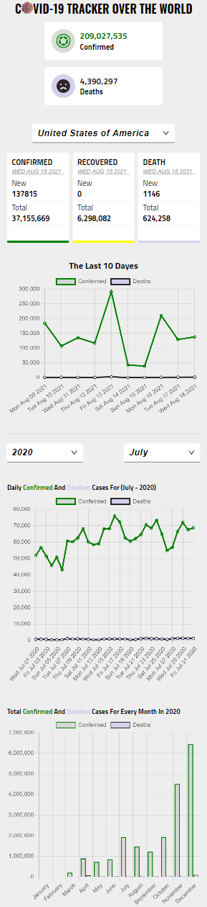

# Covid-19 tracker over all the World web app
## Screenshot

 

 

## Table of contents

- [Overview](#overview)
  - [Features](#Features)
  - [Links](#links)
  - [Screenshot](#Screenshot)
- [My process](#my-process)
  - [Built with](#built-with)
  - [Continued development](#continued-development)
- [Author](#author)

## Overview
A web app displays all covid-19 history and current cases numbers for any country in the world from the [REST covid-19 API](https://covid19api.com/) and represents them by a charts .
### Features

Main view:
- Completely responsive for all screens sizes.
- Global section: 
    - Show two small cards of the total numbers of all confirmed and deaths cases over the world until now.
- Single country section
    - Show three larger cards for confirmed, recovered, and deaths cases both new and total until now.
    - Show a Line-chart for confirmed and deaths cases over the last ten days.
    - Show a Line-chart for confirmed and deaths cases overall days of a certain month.
    - Show a Bar-chart for total confirmed and total deaths cases overall months of a certain year.

User is able to:
- Scroll through a dropdown list with over 200 countries over the world or search through an input field inside this dropdown list to Select a certain country to display all its covid-19 cases numbers.
- Scroll through a dropdown list of the year's months or search through an input field inside this dropdown list to select a certain month to display all daily cases numbers on a Line-Chart.
- Select a certain year through a dropdown list to display all month's total cases numbers on a Bar-Chart.

### Links

- Live Site URL: (https://alqiaty-covid19-tracker.netlify.app/)
- Github repo URL: (https://github.com/mahmoud-alqiaty/covid)

### Screenshot

 

 

## My process

### Built with

- Semantic HTML5 markup
- CSS custom properties
- Flexbox
- CSS Grid
- [React](https://reactjs.org/) - JS library
- [chartjs](https://www.chartjs.org/docs/latest/) - JS library
- [react-chartjs](https://github.com/reactchartjs/react-chartjs-2)
- [Styled Components](https://styled-components.com/) - For styles
- [Axios](https://axios-http.com/)

### Continued development

In future projects i will focuse on using TypeScript and Next.js.

## Author
- Github - [Mahmoud Ahmed](https://github.com/mahmoud-alqiaty)
- LinkedIn - [Mahmoud Ahmed](https://www.linkedin.com/in/mahmoud-ahmed-75551b200/)
- Frontend Mentor - [Mahmoud Ahmed](https://www.frontendmentor.io/profile/mahmoud-alqiaty)

